<div align="center">

  # 🎨 Plugin Generator

  ### ✨ Claude Codeプラグインを秒で作成できる魔法のツール ✨

  [](https://opensource.org/licenses/MIT)
  [](https://claude.ai/code)
  [](https://github.com/ShunsukeHayashi/plugin-generator)

  [機能](#-機能) • [インストール](#-インストール) • [使い方](#-使い方) • [用語集](#-用語集) • [FAQ](#-faq)

</div>

---

## 🌟 このツールって何？

**Plugin Generator**は、Claude Codeのプラグインを**自動的に作成してくれるツール**です。

💭 **「プラグインを作りたいけど、どこから手を付けたらいいの…？」**
💭 **「ディレクトリ構造とか、よくわからないな…」**

そんな悩みを**1つのコマンド**で解決します！ 🎉

---

## 🎯 機能

### 🚀 超簡単！たった1コマンド

```bash
/create-plugin my-awesome-plugin
```

これだけ！以下のファイルが自動生成されます：

```
my-awesome-plugin/
├── .claude-plugin/
│   └── plugin.json       ← プラグインの「名刺」
├── commands/
│   └── hello.md          ← サンプルコマンド
├── README.md             ← 説明書
└── .gitignore            ← Git設定
```

### ✨ 生成される内容

| ファイル | 説明 | 必要性 |
|---------|------|--------|
| 📄 `plugin.json` | プラグインの名前・バージョンなどを定義する「名刺」 | ⭐ 必須 |
| 📝 `hello.md` | 「Hello World」を表示するサンプルコマンド | ⭐ 必須 |
| 📖 `README.md` | プラグインの使い方を説明するドキュメント | ⭐ 推奨 |
| 🚫 `.gitignore` | Gitで無視するファイルを指定する設定 | ⭐ 推奨 |

---

## 📥 インストール

### ステップ1: リポジトリをクローン

```bash
git clone https://github.com/ShunsukeHayashi/plugin-generator.git
cd plugin-generator
```

### ステップ2: Claude Codeを起動

```bash
claude --plugin-dir ./plugin-generator
```

✅ これで準備完了！

---

## 🎮 使い方

### 基本的な使い方

Claude Codeのチャットで以下のコマンドを入力するだけ：

```bash
/create-plugin my-first-plugin
```

### 実行イメージ

```
あなた: /create-plugin my-first-plugin

Claude: ✅ プラグイン雛形が生成されました！

📁 ディレクトリ: my-first-plugin/

📋 生成されたファイル:
✓ .claude-plugin/plugin.json (マニフェスト)
✓ commands/hello.md (サンプルコマンド)
✓ README.md (ドキュメント)
✓ .gitignore (Git除外設定)

🚀 次のステップ:
1. cd my-first-plugin
2. plugin.json を編集してカスタマイズ
3. commands/ に新しいコマンドを追加
4. claude --plugin-dir ./my-first-plugin でテスト
```

---

## 🔰 用語集（初心者向け）

### プラグインとは？

> **「プラグイン」** = ソフトウェアに機能を追加する「拡張機能」のこと

例えると…🎮
- **ゲーム**のDLC（追加コンテンツ）
- **スマホ**のアプリ
- **ブラウザ**の拡張機能

みたいなものです！

### マニフェスト（plugin.json）とは？

> **「マニフェスト」** = プラグインの「身分証明書」

```json
{
  "name": "my-plugin",           // 名前
  "description": "説明文",        // 説明
  "version": "1.0.0",           // バージョン
  "author": { "name": "あなた" }  // 作者
}
```

### スラッシュコマンドとは？

> **「スラッシュコマンド」** = `/` から始まる特別な命令

例：
- `/create-plugin` → プラグイン作成
- `/help` → ヘルプ表示
- `/status` → 状態確認

---

## ❓ よくある質問（FAQ）

### Q1: プログラミング初心者ですが使えますか？

**A:** もちろん！✨ このツールは「初心者が最初の一歩を踏み出すための道具」です。プログラミングの知識がなくても、雛形を作るだけで使えます。

### Q2: 生成された後、どうすればいいですか？

**A:** 以下の順番で進めるのがおすすめ：

1. 📂 生成されたディレクトリに入る
   ```bash
   cd my-first-plugin
   ```

2. ✏️ `plugin.json` を編集
   ```json
   {
     "name": "my-first-plugin",
     "description": "私の最初のプラグイン！",
     "version": "1.0.0",
     "author": { "name": "あなたの名前" }
   }
   ```

3. 🧪 テスト実行
   ```bash
   claude --plugin-dir ./my-first-plugin
   ```

4. 🎉 コマンドを実行してみる
   ```
   /my-first-plugin:hello
   ```

### Q3: エラーが出たときは？

**A:** [トラブルシューティング](#-トラブルシューティング) セクションをチェックしてください！

### Q4: コマンドを追加したい場合は？

**A:** `commands/` ディレクトリに `.md` ファイルを追加するだけ！

```
commands/
├── hello.md      ← 既存
├── goodbye.md    ← 新規追加
└── help.md       ← 新規追加
```

これだけで `/my-plugin:goodbye` と `/my-plugin:help` が使えるように！

### Q5: プラグインを共有したい場合は？

**A:** GitHubリポジトリを作成して公開しましょう！

```bash
git init
git add .
git commit -m "初めてのプラグイン"
git push origin main
```

---

## 🐛 トラブルシューティング

### ❌ 「コマンドが見つかりません」と言われる

**原因:** プラグインが正しく読み込まれていません

**解決策:**
```bash
# プラグインのパスを確認
ls -la ./my-first-plugin/.claude-plugin/

# 正しいパスを指定して起動
claude --plugin-dir $(pwd)/my-first-plugin
```

### ❌ 「plugin.jsonがありません」と言われる

**原因:** ファイルが正しく生成されていません

**解決策:**
```bash
# ディレクトリ構造を確認
find my-first-plugin -type f

# 再生成
/create-plugin my-first-plugin --force
```

### ❌ 生成されたディレクトリがない

**原因:** カレントディレクトリが間違っている可能性

**解決策:**
```bash
# 現在のディレクトリを確認
pwd

# ファイルを探す
find . -name "my-first-plugin" -type d
```

---

## 💡 ヒント・ベストプラクティス

### 🎯 プラグイン名の付け方

| ⭕ 良い例 | ❌ 悪い例 |
|----------|----------|
| `weather-bot` | `plugin1` |
| `task-manager` | `my-plugin` |
| `git-helper` | `test` |

**ポイント:**
- 英小文字とハイフン `-` のみ使用
- 機能がわかる名前にする
- 短すぎず長すぎず（3〜15文字）

### 📁 プラグインの構成を理解する

```
my-plugin/
│
├── 📂 .claude-plugin/          # Claude Codeが認識する必須ディレクトリ
│   └── 📄 plugin.json          # プラグインの情報を定義
│
├── 📂 commands/                # スラッシュコマンドを定義
│   ├── 📄 hello.md            # /my-plugin:hello
│   ├── 📄 goodbye.md          # /my-plugin:goodbye
│   └── 📄 help.md             # /my-plugin:help
│
├── 📂 skills/                  # （オプション）高度な機能を定義
│   └── 📄 my-skill.md         # 複雑なタスクの手順
│
├── 📂 templates/               # （オプション）テンプレートファイル
│
├── 📄 README.md                # プラグインの説明書
└── 📄 package.json            # （オプション）npm設定
```

### 🔧 機能を追加する順番

1. **まずは動くものを作る** → `hello.md` で挨拶
2. **コマンドを増やす** → `goodbye.md` `help.md` など
3. **機能を複雑にする** → `skills/` で高度な処理
4. **テンプレートを使う** → `templates/` で効率化
5. **ドキュメントを充実** → `README.md` を丁寧に

### 🧪 テストのすすめ

新しいコマンドを作るたびにテストしましょう：

```bash
# 1. プラグインを起動
claude --plugin-dir ./my-plugin

# 2. コマンドを実行
/my-plugin:hello

# 3. 動作確認
→ 「こんにちは！」と表示されたら成功 ✅

# 4. 変更を保存
git add .
git commit -m "helloコマンドを追加"
```

---

## 🌈 学習ロードマップ

```mermaid
graph LR
    A[🔰 初心者] -->|Plugin Generator使用| B[🎯 初級者]
    B -->|コマンド追加| C[🚀 中級者]
    C -->|スキル実装| D[💎 上級者]
    D -->|MCP統合| E[👑 エキスパート]

    style A fill:#ffe6e6
    style B fill:#fff4e6
    style C fill:#e6f7ff
    style D fill:#e6ffe6
    style E fill:#f0e6ff
```



### 🔰 初心者（今ここ！）
- ✅ Plugin Generatorで雛形を作る
- ✅ `plugin.json` を理解する
- ✅ 既存のコマンドを動かす

### 🎯 初級者
- ✅ 新しいコマンドを追加する
- ✅ README.md を書く
- ✅ Gitでバージョン管理

### 🚀 中級者
- ✅ `skills/` で高度な機能を実装
- ✅ テンプレートを使う
- ✅ エラーハンドリング

### 💎 上級者
- ✅ MCPサーバーと統合
- ✅ 複数のプラグインを連携
- ✅ パッケージとして公開

### 👑 エキスパート
- ✅ プラグインエコシステムに貢献
- ✅ 他者に教える
- ✅ 新しい機能を提案

---

## 🤝 貢献（Contribute）

バグ報告・機能リクエスト・プルリクエストは大歓迎です！

1. [Issue](https://github.com/ShunsukeHayashi/plugin-generator/issues) を作成
2. フォークしてブランチを作成
3. 変更をコミット
4. プルリクエストを送信

---

## 📊 プロジェクト統計

| 項目 | 数値 |
|------|------|
| 🌟 GitHub Stars |  |
| 🴠Forks |  |
| 📠Issues |  |
| 📜 License |  |

---

## 📄 ライセンス

[MIT License](https://opensource.org/licenses/MIT)

© 2025 ShunsukeHayashi

---

<div align="center">

  ### 🎉 さあ、あなたの最初のプラグインを作りましょう！

  [はじめる](#-インストール) • [使い方](#-使い方) • [FAQ](#-faq)

  Made with ❤️ by [ShunsukeHayashi](https://github.com/ShunsukeHayashi)

</div>
